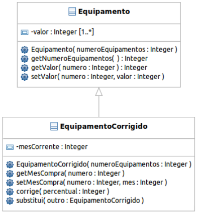

# Listagem II - Questão II

> Dada uma classe Equipamento na qual cada objeto representa um conjunto de N equipamentos de
uma empresa com seus respectivos valores, cujo diagrama UML está representado a seguir:

<p  align="center">
</img>
</p>

<table>
    <tr>
        <th>construtor</th>
        <td>Recebe como parâmetro o número de equipamentos e cria um vetor de valores do respectivo tamanho</td>
    </tr>
    <tr>
        <th>getNumeroEquipamentos</th>
        <td>Retorna o número de equipamentos</td>
    </tr>
    <tr>
        <th>getValor</th>
        <td>recebe como parâmetro o número do equipamento (começando de zero) e retorna seu valor</td>
    </tr>
    <tr>
        <th>setValor</th>
        <td>Recebe como parâmetro o número do equipamento e seu valor e o registra</td>
    </tr>
</table>

---

<h3><strong>Atenção:</strong></h3>
<ul>
    <li>Cada equipamento possui um código numérico sequencial, começando de zero, que corresponde a sua posição no vetor;</li>
    <li>Escreva uma classe, herdeira da classe Equipamento, denominada EquipamentoCorrigido em que cada objeto representa os mesmos equipamentos com valor corrigido, conforme diagrama UML parcial representado anteriormente;</li>
    <li>Todo equipamento só é corrigido anualmente no mês em que foi comprado, por este motivo a classe deve acrescentar para cada equipamento um registro do seu mês de compra. Além disto, deve possuir os métodos:</li>

</ul>

<table>
    <tr>
        <th>construtor</th>
        <td>Recebe como parâmetros o número de equipamentos e o mês corrente</td>
    </tr>
    <tr>
        <th>getMesCompra</th>
        <td>Recebe como parâmetro o número do equipamento (começando de zero) e retorna seu mês de compra por extenso, baseando-se nos métodos públicos da classe data elaborada na lista 1</td>
    </tr>
    <tr>
        <th>getDataCompra</th>
        <td>Recebe como parâmetro o número do equipamento (começando de zero) e retorna um objeto do tipo data.</td>
    </tr>
    <tr>
        <th>setDataCompra</th>
        <td>Recebe como parâmetro o número do equipamento e a data da compra, baseada na classe data elaborada na lista 1</td>
    </tr>
    <tr>
        <th>corrige</th>
        <td>Este método recebe como parâmetro apenas o percentual de correção e corrige todos os equipamentos cujo mês de compra seja igual ao mês corrente; O objeto deve manter registrado em um atributo o mês corrente, que deve começar sempre em janeiro (quando o objeto é construído). Cada vez que este método é chamado, após a correção, o mês é incrementado de um e, se estiver em dezembro, retorna para janeiro</td>
    </tr>
    <tr>
        <th>substitui</th>
        <td>Recebe como parâmetro um outro objeto da classe EquipamentoCorrigido e substitui o valor e o mês de compra de todos os equipamentos do objeto corrente pelos do objeto recebido como parâmetro; a operação só será realizada se ambos os objetos possuírem o mesmo número de equipamentos</td>
    </tr>
</table>

> Note que o atributo “valor” da classe Equipamento é privado, portanto, só poderá ser acessado
indiretamente, até mesmo pela classe herdeira.

---

Para executar toda a suíte de testes referente à este exercício:

```bash
npm run test -i .\test\lista-2\exercicio-2.test.ts -t "Lista 2 - Exercício 2"
```

Valida critérios gerais da classe Equipamentos:

```bash
node "./node_modules/jest/bin/jest.js" "./test/lista-2/exercicio-2.test.ts" -t "Lista 2 - Exercício 2 Valida critérios gerais da classe Equipamentos"
```

Valida critérios da classe EquipamentosCorrigidos relacionados à data:

```bash
node "./node_modules/jest/bin/jest.js" "./test/lista-2/exercicio-2.test.ts" -t "Lista 2 - Exercício 2 Valida critérios da classe EquipamentosCorrigidos relacionados à data"
```