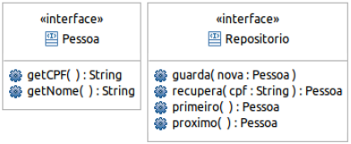

# Listagem III - Questão I

> Dadas as seguintes interfaces:

<p align="center">
    
</p>

<table>
    <tr>
       <th colspan="2"><h2>Pessoa - Representa Genéricamente uma Pessoa</h2></th> 
    </tr>
    <tr>
        <th>getCpf</th>
        <td>Retorna o CPF da pessoa</td>
    </tr>
    <tr>
        <th>getNome</th>
        <td>Retorna o nome da pessoa</td>
    </tr>
    <tr>
        <th>tipo</th>
        <td>ecebe como parâmetro o número da cadeira e retorna ‘F’ se for uma cadeira para fumantes e ‘N’ se for para não fumantes</td>
    </tr>
    <tr>
        <th>tipo</th>
        <td>recebe como parâmetro o número da cadeira e retorna ‘Fumante’ se for uma cadeira para fumantes e ‘Não Fumante’ se for para não fumantes</td>
    </tr>
    <tr>
       <th colspan="2"><h2>Repositorio – representa genericamente um repositório</h2></th> 
    </tr>
    <tr>
        <th>guarda</th>
        <td>guarda uma pessoa</td>
    </tr>
    <tr>
        <th>recupera</th>
        <td>recupera pessoa com o CPF informado</td>
    </tr>
    <tr>
        <th>primeiro</th>
        <td>se desloca para a primeira pessoa e a retorna</td>
    </tr>
    <tr>
        <th>proximo</th>
        <td>se desloca para a próxima pessoa e a retorna</td>
    </tr>
</table>

> Escreva uma classe denominada utilitários que possua os seguintes métodos:

<table>
    <tr>
        <th>duplica</th>
        <td>Recebe como parâmetro dois objetos que implementam a interface Repositorio A e B e copia todas as pessoas o repositório A para o repositório B.</td>
    </tr>
    <tr>
        <th>diferenca</th>
        <td>Recebe como parâmetro três objetos que implementam a interface Repositorio A, B e C e coloque no repositório C todas as pessoas de A que não estiverem em B.</td>
    </tr>
</table>

---

Para executar toda a suíte de testes referente à este exercício:

```bash
npm run test -i .\test\lista-3\exercicio-1.test.ts -t "Lista 3 - Exercício 1"
```

Valida critérios de adição e busca de pessoas:

```bash
node "./node_modules/jest/bin/jest.js" "./test/lista-3/exercicio-1.test.ts" -t "Lista 3 - Exercício 1 Valida critérios de adição e busca de pessoas"
```

Deveria validar os critérios de busca sequencial:

```bash
node "./node_modules/jest/bin/jest.js" "./test/lista-3/exercicio-1.test.ts" -t "Lista 3 - Exercício 1 Deveria validar os critérios de busca sequencial"
```

Valida critérios da classe Utilitários:

```bash
node "./node_modules/jest/bin/jest.js" "./test/lista-3/exercicio-1.test.ts" -t "Lista 3 - Exercício 1 Valida critérios da classe Utilitários"
```
